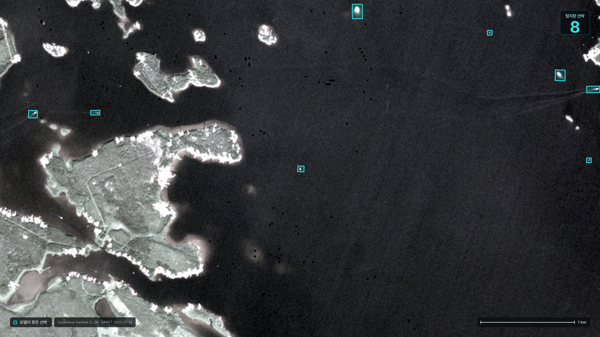
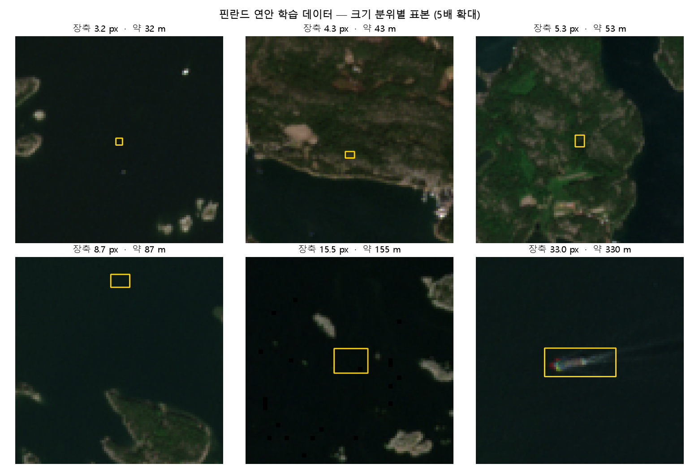
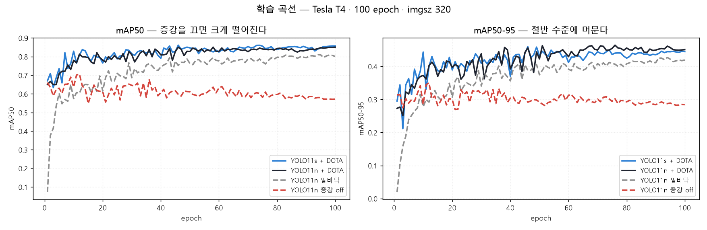
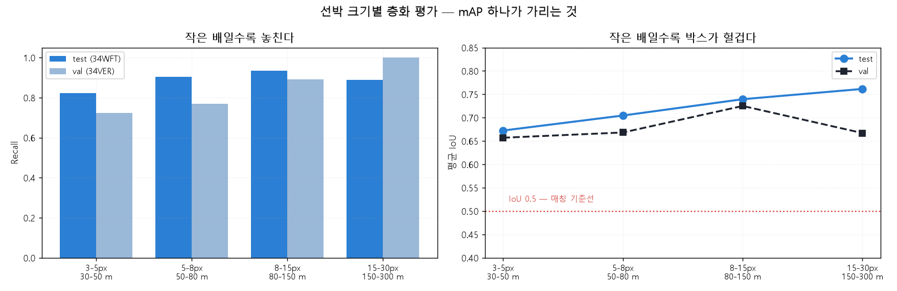
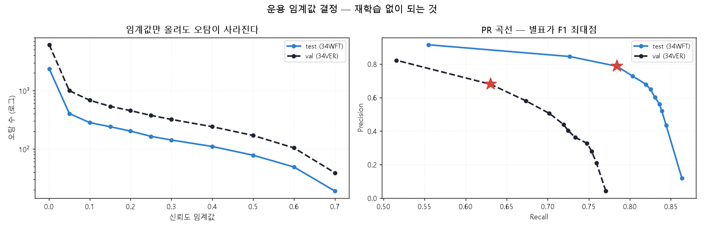

# 코멘토 3차 업무 — Sentinel-2 위성사진 선박 객체탐지

10 m 해상도 Sentinel-2 위성사진에서 선박을 찾습니다. 핀란드 연안 데이터로
학습·평가했고, **못 본 해역**에서 `test mAP50 0.9014` 를 얻었습니다.
한국 확장은 4차 과제입니다 (10절).

핵심 결론부터 적습니다.

> **mAP50-95 0.459 는 모델의 성능이 아니라 지표의 산물이었습니다.**
> 같은 모델을 점 기준으로 재면 **AP 0.911 · 재현율 0.992 · 중심 오차 0.46 px(약 5 m)** 입니다.
> 이 데이터의 선박은 장변 중앙값이 **5.2 픽셀**입니다. 이 크기에 IoU 0.75 이상의
> 정합을 요구하는 것은 부분 픽셀 정확도를 요구하는 것과 같습니다.



학습에 쓰지 않은 해역(34WFT)에서 선박이 몰린 6.4 x 3.6 km 입니다.
신뢰도 0.5(F1 최고점)에 물 위 필터를 걸어 8척을 찾았습니다. 같은 창의 정답
라벨은 11척이고, 그중 6척을 찾았습니다. 남은 2척은 라벨에 없는 자리인데,
주변 물과의 밝기 차가 64 DN 으로 찾은 배(21 DN)보다 밝아 라벨이 빠뜨린
배로 보입니다.

배는 장변이 5 화소입니다. 형체가 읽히려면 30 화소쯤은 되어야 하니 배율이 6배는
필요하고, 그러면 10 m 화소 하나도 발표 화면에서 0.34 mm 로 함께 보입니다. 이 둘은
5 대 1 로 묶여 있어 따로 정할 수 없습니다 — 배의 형체를 보려면 그 배를 이루는
화소도 보인다는 뜻입니다.

주석과 짝이 없는 2건은 주변 물과의 밝기 차가 64 DN 으로,
겹친 배(21 DN)보다 오히려 밝습니다. 모델이 헛짚은 것이 아니라 주석에 빠진
배로 보는 편이 맞습니다. 이 창의 겹침을 재현율로 읽으면 안 되는 이유이고, 평가셋
396타일 전체 기준 수치는 3절과 5절에 있습니다.


---

## 1. 구성

```
03_ship_detection/
├── src/
│   ├── build_dataset.py        핀란드 주석 + AWS COG → 타일·OBB 라벨
│   ├── build_gfw_dataset.py    GFW 탐지 → 타일 라벨            (4차용)
│   ├── fetch_gfw.py            GFW 6GB 스트리밍 추출           (4차용)
│   ├── eval_size_strata.py     선박 크기별 층화 평가
│   ├── eval_point.py           점 기반 평가          ← 핵심
│   ├── operating_point.py      운용 임계값 결정
│   ├── eval_korea_ports.py     한국 항만 GFW 참조 평가         (4차용)
│   ├── korea_ports.py          항만 22곳 → 장면 검색 → 탐지    (4차 웹앱의 핵심)
│   ├── measure_box_convention.py   라벨의 박스 규약 실측  ← 회전 부재를 잡아낸 도구
│   ├── verify_aihub_convention.py  AI Hub 규약 확정 (좌표계·각도 부호 전수 시험)
│   ├── measure_representable_width.py  10 m 에서 폭이 표현되는가  ← 규약 논쟁의 결말
│   ├── bench_cpu.py            ONNX 내보내기·CPU 지연시간 (4차 웹앱의 전제)
│   ├── figures.py              그림 생성
│   ├── fig_before_after.py     타일을 확대해 원본·탐지를 나란히 (fig_hero 이전)
│   ├── fig_hero.py             탐지 결과 대표 그림 (PPT 3장)
│   ├── fig_port.py             한국 항만 그림 + GFW 정답 대조
│   ├── make_ppt.py             보고용 PPT 생성
│   └── yolo11-p2-obb.yaml      P2(stride 4) 헤드 모델 설정
├── kernel/                     카글 GPU 학습 커널
└── outputs/                    결과 JSON·그림
```

## 2. 데이터

### 학습 — 핀란드 연안 Sentinel-2

[Zenodo 15019034](https://zenodo.org/records/15019034) · CC-BY-4.0 ·
*Remote Sensing of Environment* 2025 · [저자 코드](https://github.com/mayrajeo/ship-detection)

Zenodo 는 주석(GeoPackage)만 주고 위성사진은 없습니다. 사진은 **AWS 공개 COG
(Sentinel-2 L2A TCI)** 에서 인증 없이 받아 맞췄습니다. 주석은 L1C 기준이지만
L2A 는 같은 촬영·같은 격자라 기하가 동일합니다.

| split | 타일 | 선박 있음 | 인스턴스 | 지역 |
|---|---|---|---|---|
| train | 6,261 | 3,798 | 12,354 | 34VEM · 34VEN · 35VLG |
| val | 353 | 215 | 349 | 34VER |
| test | 396 | 241 | 366 | 34WFT |

**지역 단위로 갈랐습니다.** 같은 해역이 학습과 평가에 섞이면 성능이 부풀려집니다.
평가는 못 본 해역에서만 이뤄집니다.

선박 크기는 20 m 부터 700 m 까지 넓습니다 — 150 m 이상 대형선이 665척입니다.
"레저용 소형선만 있을 것"이라는 예상은 측정으로 뒤집혔습니다.



## 3. 학습

Tesla T4 · 100 epoch · imgsz 320 · batch 32.

| 실험 | val mAP50 | mAP50-95 | P | R | **test mAP50** | 시간 |
|---|---|---|---|---|---|---|
| YOLO11n 증강 off | 0.7068 | 0.3517 | 0.712 | 0.696 | 0.7678 | 41분 |
| YOLO11n 밑바닥 | 0.8106 | 0.4266 | 0.825 | 0.751 | 0.8734 | 51분 |
| YOLO11n + DOTA | 0.8390 | 0.4613 | 0.794 | 0.759 | 0.8809 | 51분 |
| **YOLO11s + DOTA** | **0.8628** | 0.4587 | 0.800 | 0.788 | **0.9014** | 57분 |

**성능 향상 전략 세 가지가 모두 효과가 있었습니다.**

| 전략 | 효과 |
|---|---|
| 데이터 증강 | 끄면 0.839 → **0.707** (−13.2%p) |
| DOTA 항공영상 사전학습 | 밑바닥 대비 **+2.8%p** (같은 시간에) |
| 모델 크기 n → s | **+2.4%p** |



## 4. 크기별 층화 — mAP 하나가 가리는 것

전체 test mAP50 이 0.9014 입니다. 크기로 나누면 다르게 보입니다.

| 장축 | 실제 길이 | GT | AP50 | Recall | **평균 IoU** |
|---|---|---|---|---|---|
| 3–5 px | 30–50 m | 204 | 0.788 | 0.824 | **0.672** |
| 5–8 px | 50–80 m | 93 | 0.805 | 0.903 | **0.705** |
| 8–15 px | 80–150 m | 60 | 0.810 | 0.933 | **0.739** |
| 15–30 px | 150–300 m | 9 | 0.838 | 0.889 | **0.762** |

**세 지표가 모두 크기와 함께 단조 증가합니다.** 작은 배일수록 놓치고, 찾아도
박스가 헐겁습니다. 이것이 `mAP50 0.86` 과 `mAP50-95 0.46` 의 격차를 설명합니다.



## 5. 핵심 결과 — 지표를 바꾸니 결론이 뒤집혔습니다

5 픽셀짜리 물체에 IoU 0.75 를 요구하는 것은 지표의 함정입니다.
IoU 는 두 박스의 겹침을 재는데, 그 박스가 실제 선박의 윤곽이 아니기 때문입니다.

```
IoU 오차 = 모델의 위치 오차  +  라벨 규약이 만든 오차
```

5 픽셀 물체에서는 뒷항이 앞항만큼 큽니다. 나중에 **뒷항이 더 크다**는 것을
좌표 전수 측정으로 확인했습니다 — 라벨이 회전 없는 축 정렬 사각형이고,
폭은 아예 화소로 존재하지 않습니다. 7-(2) 를 보십시오.

**즉 mAP50-95 는 모델이 아니라 라벨 규약을 재고 있었습니다.** 점 기반 평가는
그 교란을 통째로 제거합니다 — 중심 위치는 규약과 무관하기 때문입니다.

| 지표 | 값 |
|---|---|
| IoU 기반 mAP50 | 0.901 |
| IoU 기반 **mAP50-95** | **0.459** |
| **점 기반 AP** | **0.911** |
| **점 기반 Recall** | **0.992** |
| 중심 오차 (중앙값) | **0.46 px** = 약 5 m |
| 중심 오차 (p90) | 1.07 px |

### 크기별로 보면 더 분명합니다

| 장축 | GT | Recall | 중심 오차 |
|---|---|---|---|
| 3–5 px | 204 | **1.000** | 0.41 px |
| 5–8 px | 93 | **1.000** | 0.52 px |
| 8–15 px | 60 | 0.950 | 0.62 px |
| 15–30 px | 9 | **1.000** | 1.50 px |

**IoU 기준으로 "가장 나쁜"(평균 IoU 0.672) 3–5 px 구간이, 위치로는 가장 정확합니다**
(중심 오차 0.41 px). 작은 배에서 IoU 가 낮은 것은 물체가 작아 같은 절대 오차가
IoU 에 크게 반영되기 때문이지, 모델이 못 맞혀서가 아닙니다.

## 6. 운용 임계값 — 재학습 없이 오탐 97% 감소

층화 평가에서 오탐이 test 2,353건 / val 6,082건 나왔습니다. GT 가 각각 366, 349개인데
6~17배입니다. 그런데 이 값은 **PR 곡선을 그리려고 신뢰도 하한을 0.001 로 둔 것**이지
운용 설정이 아닙니다.

손실함수를 고치거나 하드 네거티브를 넣기 전에 먼저 확인할 것이 있었습니다 —
그 오탐이 정말 문제인가, 아니면 임계값 하나로 사라지는가.

| split | 임계값 | 오탐 | Precision | Recall |
|---|---|---|---|---|
| test | 0.001 | 2,353 | 0.118 | 0.863 |
| **test** | **0.50** | **78** | **0.786** | 0.784 |
| val | 0.001 | 6,082 | 0.042 | 0.771 |
| **val** | **0.60** | **104** | **0.679** | 0.630 |

**오탐이 96.7% / 98.3% 사라집니다.** 재현율은 8~14%p 만 잃습니다.
손실함수 FP 가중이나 하드 네거티브 마이닝은 필요하지 않았습니다.



### 해역이 다르면 최적 운용점도 다릅니다

같은 모델인데 val 은 임계값을 0.60 까지 올려야 하고, 그래도 F1 이 13%p 낮습니다
(0.654 vs 0.785). **항만마다 임계값을 따로 잡아야 한다**는 뜻이고, 4차 웹앱의
요구사항이 됩니다.

## 7. 조용히 틀리는 버그 두 개

에러도 경고도 없이 결과만 망가뜨리는 종류입니다. 전부 실측으로 잡았습니다.

### (1) 창이 잘리면서 라벨이 190 px 밀렸습니다

`rasterio` 의 `read(window=...)` 는 창이 래스터 밖으로 나가면 **말없이 잘라**
더 작은 배열을 줍니다. 그런데 `window_transform()` 은 '요청한' 창 기준이라
자른 만큼 라벨이 통째로 밀립니다.

주석이 타일 가장자리까지 닿아 있어 **매번** 발생했고 최대 190 px 어긋났습니다.
표본을 눈으로 보다가 박스가 육지 위에 있는 것을 발견했고, 원본 주석을 COG 에
직접 찍었을 때는 대비 +34 / 육지 0% 로 멀쩡해서 변환 코드로 범위를 좁혔습니다.
`w.crop(height, width)` 로 먼저 자르니 정렬이 **99.5%** 로 회복됐습니다.

### (2) 8좌표 OBB 형식이었지만 회전이 없었습니다

가장 오래 못 본 것입니다. **형식과 규약을 혼동했습니다.**

핀란드 라벨은 `class x1 y1 x2 y2 x3 y3 x4 y4` 여덟 좌표로 배포됩니다. 그래서
회전 박스라고 믿고 학습과 평가를 짰습니다. 좌표를 13,069개 전수로 찍어 보니
아니었습니다.

```
축 정렬       13,069개 중 100.00%
장변 각도     0~10도 6,343 / 80~90도 6,726 / 그 사이 0개
```

**회전 박스가 아니라 축 정렬 사각형(HBB)입니다.** 여기에 `degrees=0`
(ultralytics 기본값) 이라 증강도 회전을 만들지 않았습니다. **모델은 회전된
박스를 한 번도 본 적이 없습니다.**

DOTA 논문이 이 문제를 정확히 지적하고 있었습니다.

> 기존의 HBB 는 선박 및 대형 차량과 같은 oriented objects 의 위치를 제대로
> 파악할 수 없다

종횡비도 물리가 아니었습니다.

| 장변 L | 개수 | W/L 중앙 | W 중앙 (px) |
|---|---|---|---|
| 0–3 px | 146 | 0.958 | 2.67 |
| 3–5 px | 5,671 | 0.888 | 3.61 |
| 5–8 px | 3,603 | 0.790 | 4.61 |
| 8–15 px | 2,697 | 0.633 | 6.70 |
| 15–30 px | 875 | 0.534 | 10.02 |
| 30+ px | 77 | 0.493 | 20.06 |

실제 선박의 폭/길이는 0.12~0.25 이고 **크기와 무관합니다.** 파나막스든 어선이든
비슷합니다. 그런데 0.958 에서 0.493 으로 단조 감소합니다. 배의 모양이 아니라
**작은 배를 뭉툭하게 칠한 주석 습관**입니다. 3–5 px 구간의 폭 중앙값 3.61 px 는
36 m 인데, 길이 40 m 급 배의 폭이 36 m 일 수 없습니다.

이 버그는 (1) 과 성격이 다릅니다. **정렬 검사로도, 눈으로 봐도 안 잡힙니다.**
박스는 배 위에 정확히 있고 크기도 그럴듯합니다. 각도 분포를 찍어야만 보입니다.

```bash
py src/measure_box_convention.py --labels <라벨 폴더>
```

**처방** — 주석 규약의 기준은 DOTA (Ding et al., 2021) 가 문서화한 표준을
따릅니다. 네 꼭짓점을 시계방향, 첫 점은 뱃머리, 시각 단서가 없으면 좌상단.

재라벨링 없이 되는 것은 회전 증강 `degrees=180` 입니다. 라벨이 축 정렬이어도
영상을 돌리면 박스가 함께 돌아 `{0도, 90도}` 축퇴가 깨집니다. NMS 도 DOTA 가
OBB 에 쓰는 `0.1` 로 내립니다 (기본값 `0.5`).

그리고 DOTA 논문은 이 크기에 대해 이미 경고하고 있었습니다.

> 약 10 픽셀 미만의 인스턴스 ... recall 은 아주 낮다

DOTA 는 이 구간을 **학습에서 제외**합니다. 수치 불안정을 일으키기 때문입니다.
우리 선박은 장변 중앙값이 **5.23 px** 로 그 절반입니다. 이것이 3차 결과를 읽는
정직한 틀입니다 — 표준 데이터셋이 스스로 버리는 크기에서 작업하고 있습니다.

### 규약 논쟁의 결말 — 폭은 존재하지 않습니다

(2) 를 고치려면 "옳은 종횡비" 를 정해야 합니다. 그런데 정하기 전에 먼저
물었어야 할 것이 있었습니다. **10 m 영상에 선박의 폭이 화소로 존재하는가.**

핀란드 13,069척으로 쟀습니다. 길이 중앙값은 52.3 m, 즉 **5.23 px** 입니다.
라벨은 실제 폭을 알려주지 않으므로, 실제 선박이 가질 수 있는 비율 전 범위를
넣어 봤습니다.

| 가정한 W/L | 폭 중앙값 | 2 px 미만 | 1 px 미만 |
|---|---|---|---|
| 0.12 (상선) | 0.63 px | **94.9%** | 73.6% |
| 0.15 | 0.78 px | **89.9%** | 64.8% |
| 0.20 | 1.05 px | **80.2%** | 44.5% |
| 0.25 (어선) | 1.31 px | **72.1%** | 15.4% |

**어떤 비율을 골라도 72~95% 가 폭 2 px 미만입니다.** 즉 규약을 무엇으로
정하느냐의 문제가 아니라, **잴 대상 자체가 없습니다.**

여기서 세 가지가 따라 나옵니다.

1. **회전 박스의 단변은 허구입니다.** 어떤 종횡비도 옳지 않습니다.
2. **측정 가능한 것은 중심점·길이·방향 셋뿐입니다.** 평가는 점 기반이어야
   합니다. IoU 는 존재하지 않는 축을 재게 됩니다.
3. **더 정밀한 정답도 이것을 못 고칩니다.** 0.5 m 라벨에서 실측 폭을 얻어도
   10 m 로 내리면 다시 서브픽셀입니다.

xView3-SAR (NeurIPS 2022) 가 같은 10 m 급에서 박스를 버리고 점 기반 F1 을
쓴 이유가 이것입니다. 실용적 타협이 아니라 **박스가 정의되지 않기 때문**입니다.

```bash
py src/measure_representable_width.py
```

## 8. CPU 만으로 되는가 — 4차의 전제

4차는 웹앱입니다. 항구를 고르면 그 자리에서 탐지가 돌아야 하는데, GPU 서버를
항상 켜 두는 것은 개인 과제에서 현실적이지 않습니다. 그래서 먼저 쟀습니다.

### 측정이 한 번 오염됐습니다

처음에는 한 프로세스에서 PyTorch 와 ONNX Runtime 을 차례로 쟀습니다. 같은
스크립트를 두 번 돌렸더니 ONNX 8 스레드가 `128.0 ms` 와 `25.9 ms` 로 **5 배**
달랐습니다. 노이즈가 아니라 계통 오차입니다 — 두 런타임이 각자 스레드 풀을
만들어 18 코어를 두고 경합했습니다. 첫 수치로 "ONNX 가 더 느리다" 고 결론
낼 뻔했습니다.

설정 하나당 프로세스를 새로 띄우니 반복 간 차이가 `1.0x` 로 내려왔습니다.

### 결과 (Intel 18 코어, 320x320 타일 한 장, p50)

| 방식 | 1 | 2 | 4 | 8 | 16 스레드 |
|---|---|---|---|---|---|
| PyTorch 끝에서 끝까지 | 54.2 | 55.1 | 53.8 | 54.6 | 53.6 |
| ONNX 끝에서 끝까지 | 124.3 | 116.5 | 201.0 | 117.2 | 124.1 |
| **ONNX `session.run` 만** | 76.0 | 45.5 | 33.9 | **25.9** | 132.7 |

세 가지가 보입니다.

1. **PyTorch 는 스레드 수에 반응하지 않습니다** (53.6~55.1 ms). 병목이 행렬
   연산이 아니라는 뜻입니다.
2. **순수 순전파는 25.9 ms 입니다.** PyTorch 끝에서 끝까지가 54 ms 이므로
   **나머지 28 ms 는 전처리·NMS·파이썬 오버헤드**입니다.
3. **ultralytics 의 ONNX 경로는 쓰면 안 됩니다** (117~201 ms). 순전파가 26 ms
   인데 끝에서 끝까지가 120 ms 입니다. 90 ms 를 껍데기가 먹습니다.

16 스레드에서 무너지는 것도 일관됩니다 (25.9 → 132.7). 논리 코어가 18 개라
초과 구독입니다. **8 이 최적입니다.**

### 항만 한 곳 주사

| 창 크기 (px) | 타일 | 추론 |
|---|---|---|
| 1232 × 1110 | 25 | 1.34 초 |
| 1583 × 1331 | 30 | 1.61 초 |
| 1584 × 1554 | 36 | 1.93 초 |
| 2112 × 1554 | 54 | 2.90 초 |

**중앙값 1.61 초입니다** (영상 내려받기는 별도). GPU 없이 4차를 설계할 수 있습니다.

### 4차에 넘길 설계

ONNX Runtime 을 `intra_op=8` 로 직접 부르고 NMS 를 직접 씁니다. 순전파 26 ms
에 자체 후처리를 얹으면 타일당 30~35 ms 가 되어 항만 한 곳이 **1 초 아래**로
내려갑니다. ultralytics 껍데기를 거치면 오히려 두 배 느려집니다.

```bash
py src/bench_cpu.py --weights weights/yolo11s_dota.pt
```

## 9. 실행

```bash
pip install -r requirements.txt

python src/build_dataset.py                       # 핀란드 학습셋 구축
python src/eval_size_strata.py --weights <best.pt> --split test
python src/eval_point.py       --weights <best.pt> --split test
python src/operating_point.py  --weights <best.pt> --split test
python src/korea_ports.py --port busan_anchorage --weights <best.pt>   # conf 0.05 + 물 게이트
python src/figures.py
python src/fig_hero.py --weights <best.pt>       # 탐지 결과 대표 그림
python src/fig_port.py --weights <best.pt>       # 한국 항만 + GFW 대조
python src/make_ppt.py                           # 보고용 PPT
```

데이터셋은 용량 때문에 저장소에 없습니다. 스크립트가 Zenodo 주석과 AWS 공개
COG 에서 직접 받아 재구성합니다.

## 10. 4차로 넘길 것 — 한국 확장

3차는 핀란드 해역에서 끝냅니다. 4차는 이 모델을 한국으로 가져가 웹앱으로
만드는 것이고, 준비는 이미 되어 있습니다.

### 이미 준비된 것

| | 내용 |
|---|---|
| 항만 목록 | 22곳 등록 완료 (`korea_ports.py`) — 4차는 이 중 한 곳부터 |
| 장면 수신 | AWS 공개 COG · 인증 불필요 |
| 추론 | CPU 만으로 항만 한 곳 1.61 초 (8절) |
| 참조 자료 | GFW 한국 근해 443,344건 · 57.1% 가 AIS 대조 |

`korea_ports.py` 가 "항만 이름 → 최신 무운 장면 검색 → 수신 → 겹쳐 탐지 →
NMS" 를 한 함수로 합니다. 항만 22곳이 그대로 드롭다운이 됩니다. GPU 서버를
상시 켜 둘 필요가 없다는 것은 8절에서 실측으로 확인했습니다.

Global Fishing Watch 는 Sentinel-2 10 m 전 지구 선박 탐지를 공개합니다.
사람이 그린 정답은 아니지만 절반 이상이 AIS 로 대조돼 있어, 한국 해역에서
독립적인 참조로 쓸 수 있습니다.

### 먼저 한 곳부터

항만 22곳을 다 여는 대신 **한 곳을 제대로 만드는 것부터** 시작합니다.
드롭다운에 항목을 늘리는 일은 언제든 되지만, 조건이 나쁜 항만을 함께 넣으면
전체가 흔들립니다.

고르는 기준은 이 모델의 학습 조건과 얼마나 닮았는가입니다.

| 조건 | 유리한 쪽 |
|---|---|
| 배경 | 열린 바다 — 부두·시가지·갯벌이 창 안에 적을 것 |
| 물 색 | 어두운 물 — 핀란드 학습 데이터의 전제가 그대로 성립합니다 |
| 선박 | 정박 중인 대형선 — 정지해 있어 형태가 안정적입니다 |
| 표본 | 수십 척 이상 — 보여주기에 충분할 것 |

한 곳이 자리를 잡으면 같은 조건을 만족하는 항만부터 차례로 넓힙니다.
탁수 해역은 NIR 채널을 넣은 뒤에 엽니다.

### 4차 작업 목록

- **한국 해역 데이터 보강** — 발트해와 다른 배경(양식 시설, 갯벌, 탁수)을
  학습에 넣습니다. 해역이 바뀌면 배경도 바뀝니다.
- **서해 탁도 — NIR(B08) 을 4번째 채널로** — 탁한 물도 근적외에서는 어둡습니다
  (NDWI 가 작동하는 원리). 지금은 TCI 3채널만 씁니다.
- **P2 헤드 (stride 4)** — 3~5 px 물체에 stride 8 격자는 거칩니다.
  설정은 `yolo11-p2-obb.yaml` 로 준비돼 있습니다.
- **항만별 임계값** — 6절에서 해역마다 최적 운용점이 다름을 측정했습니다.
  웹앱은 항만별 임계값과 신뢰도 표시를 가져야 합니다.
- **웹앱 배포** — Vercel 서버리스는 번들 250 MB 제한이라 PyTorch 를 싣지
  못합니다. ONNX Runtime 을 직접 호출하는 경로 (8절) 가 현실적입니다.
- **표시 방식** — 탐지 결과는 회전 박스가 아니라 중심점과 길이·방향으로
  표시합니다. 7-(2) 에서 확인했듯 10 m 에서 실제로 측정되는 것이 그 셋입니다.

## 11. 선행연구

| 연도 | 내용 |
|---|---|
| 2021 | S2-SHIPS — 최초의 픽셀 단위 Sentinel-2 선박 데이터셋 (항만·해협) |
| 2024 | Sentinel2-Ship — 암초·심해 배경, OBB 라벨 (남중국해) |
| **2025** | **핀란드 연안 — YOLO 로 레저 선박 지도화 (RSE)** ← 이 과제의 학습 데이터 |
| 상시 | **Global Fishing Watch — Sentinel-2 전 지구 선박 탐지** ← 참조 데이터 |
