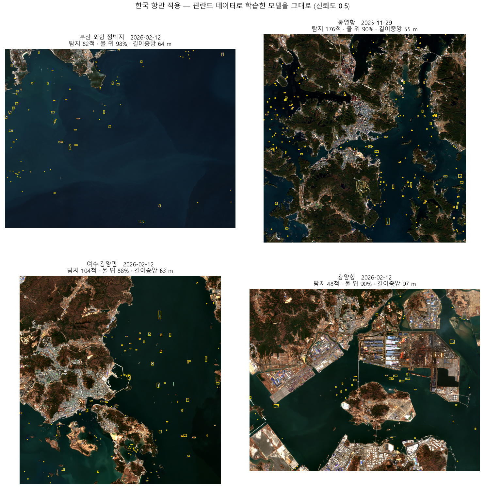

# 코멘토 3차 업무 — Sentinel-2 위성사진 선박 객체탐지

10 m 해상도 위성사진에서 선박을 찾고, **해외 데이터로 학습한 모델을 한국 항만에
그대로 가져가면 무엇이 되고 무엇이 안 되는지**를 측정했습니다.

핵심 결론부터 적습니다.

> **mAP50-95 0.459 는 모델의 성능이 아니라 지표의 산물이었습니다.**
> 같은 모델을 점 기준으로 재면 **AP 0.911 · 재현율 0.992 · 중심 오차 0.46 px(약 5 m)** 입니다.
> 한국 근해 선박은 길이 중앙값 30 m = **3 픽셀**인데, 3 픽셀짜리 물체에
> IoU 0.75 이상의 정합을 요구하는 것 자체가 부분 픽셀 정확도를 요구하는 것과 같습니다.

---

## 1. 구성

```
03_ship_detection/
├── src/
│   ├── build_dataset.py        핀란드 주석 + AWS COG → 타일·OBB 라벨
│   ├── build_gfw_dataset.py    GFW 탐지 → 타일·OBB 라벨 (길이·방향으로 박스 계산)
│   ├── fetch_gfw.py            GFW 6GB 를 스트리밍하며 관심 해역만 추출
│   ├── eval_size_strata.py     선박 크기별 층화 평가
│   ├── eval_point.py           점 기반 평가          ← 핵심
│   ├── operating_point.py      운용 임계값 결정
│   ├── eval_korea_ports.py     한국 항만 GFW 정답 정량 평가
│   ├── korea_ports.py          항만 22곳 → 장면 검색 → 탐지 (4차 웹앱의 핵심)
│   ├── measure_box_convention.py   라벨의 박스 규약 실측  ← 회전 부재를 잡아낸 도구
│   ├── verify_aihub_convention.py  AI Hub 규약 확정 (좌표계·각도 부호 전수 시험)
│   ├── figures.py              그림 생성
│   └── yolo11-p2-obb.yaml      P2(stride 4) 헤드 모델 설정
├── kernel/                     카글 GPU 학습 커널
└── outputs/                    결과 JSON·그림
```

## 2. 데이터

### 학습 — 핀란드 연안 Sentinel-2

[Zenodo 15019034](https://zenodo.org/records/15019034) · CC-BY-4.0 ·
*Remote Sensing of Environment* 2025 · [저자 코드](https://github.com/mayrajeo/ship-detection)

Zenodo 는 주석(GeoPackage)만 주고 위성사진은 없습니다. 사진은 **AWS 공개 COG
(Sentinel-2 L2A TCI)** 에서 인증 없이 받아 맞췄습니다. 주석은 L1C 기준이지만
L2A 는 같은 촬영·같은 격자라 기하가 동일합니다.

| split | 타일 | 선박 있음 | 인스턴스 | 지역 |
|---|---|---|---|---|
| train | 6,261 | 3,798 | 12,354 | 34VEM · 34VEN · 35VLG |
| val | 353 | 215 | 349 | 34VER |
| test | 396 | 241 | 366 | 34WFT |

**지역 단위로 갈랐습니다.** 같은 해역이 학습과 평가에 섞이면 성능이 부풀려집니다.
평가는 못 본 해역에서만 이뤄집니다.

선박 크기는 20 m 부터 700 m 까지 넓습니다 — 150 m 이상 대형선이 665척입니다.
"레저용 소형선만 있을 것"이라는 예상은 측정으로 뒤집혔습니다.


### 참조 — Global Fishing Watch 전 지구 탐지

[Zenodo 16363632](https://zenodo.org/records/16363632) · Sentinel-2 10 m ·
2019년~현재 · 대부분의 EEZ 와 해양보호구역

6 GB CSV 를 흘려 읽으며 관심 해역만 남겼습니다(전 지구 1,707만 건 중 213만 건).

| 해역 | 탐지 | 길이 중앙 | AIS 매칭 | 인프라 |
|---|---|---|---|---|
| **한국** | **443,344** | 30 m (3.0 px) | 57.1% | 1.6% |
| 황해 | 1,028,127 | 41 m (4.1 px) | 69.7% | 10.1% |
| 동중국해 | 666,249 | 51 m (5.1 px) | 76.7% | 10.6% |

스키마가 좋습니다 — 점 + 길이 + 방향 + 선박확률 + 인프라 여부 + AIS.
**길이와 방향이 있으니 회전 박스를 계산으로 만듭니다.** 그리고 AIS 매칭이
57~77% 라, 사람 판단이 아니라 **선박 자신의 송신으로 검증된 참조**입니다.

> **한계** — GFW 도 딥러닝 탐지 결과입니다. 자체 선박확률이 붙어 있고 전수도
> 아닙니다. "정답"이라기보다 **독립적인 참조**로 씁니다.

## 3. 학습

Tesla T4 · 100 epoch · imgsz 320 · batch 32.

| 실험 | val mAP50 | mAP50-95 | P | R | **test mAP50** | 시간 |
|---|---|---|---|---|---|---|
| YOLO11n 증강 off | 0.7068 | 0.3517 | 0.712 | 0.696 | 0.7678 | 41분 |
| YOLO11n 밑바닥 | 0.8106 | 0.4266 | 0.825 | 0.751 | 0.8734 | 51분 |
| YOLO11n + DOTA | 0.8390 | 0.4613 | 0.794 | 0.759 | 0.8809 | 51분 |
| **YOLO11s + DOTA** | **0.8628** | 0.4587 | 0.800 | 0.788 | **0.9014** | 57분 |

**성능 향상 전략 세 가지가 모두 효과가 있었습니다.**

| 전략 | 효과 |
|---|---|
| 데이터 증강 | 끄면 0.839 → **0.707** (−13.2%p) |
| DOTA 항공영상 사전학습 | 밑바닥 대비 **+2.8%p** (같은 시간에) |
| 모델 크기 n → s | **+2.4%p** |


## 4. 크기별 층화 — mAP 하나가 가리는 것

전체 test mAP50 이 0.9014 입니다. 크기로 나누면 다르게 보입니다.

| 장축 | 실제 길이 | GT | AP50 | Recall | **평균 IoU** |
|---|---|---|---|---|---|
| 3–5 px | 30–50 m | 204 | 0.788 | 0.824 | **0.672** |
| 5–8 px | 50–80 m | 93 | 0.805 | 0.903 | **0.705** |
| 8–15 px | 80–150 m | 60 | 0.810 | 0.933 | **0.739** |
| 15–30 px | 150–300 m | 9 | 0.838 | 0.889 | **0.762** |

**세 지표가 모두 크기와 함께 단조 증가합니다.** 작은 배일수록 놓치고, 찾아도
박스가 헐겁습니다. 이것이 `mAP50 0.86` 과 `mAP50-95 0.46` 의 격차를 설명합니다.


## 5. 핵심 결과 — 지표를 바꾸니 결론이 뒤집혔다

3 픽셀짜리 물체에 IoU 0.75 를 요구하는 것은 지표의 함정입니다.
그리고 근거가 하나 더 있습니다 — **참조로 쓰는 GFW 정답이 애초에 박스가 아니라
점입니다.** 회전 박스는 길이·방향으로 제가 합성한 것입니다. 그러면

```
IoU 오차 = 모델의 위치 오차  +  박스 합성 오차  +  규약 불일치 (회전)
```

이고, 3 픽셀 물체에서는 뒷항이 앞항만큼 큽니다. **즉 mAP50-95 는 모델이 아니라
제 박스 합성을 재고 있었습니다.** 점 기반 평가는 그 교란을 통째로 제거합니다.

나중에 **세 번째 항이 가장 크다**는 것을 알게 됐습니다. 학습 라벨에 회전이
아예 없었고, 평가 정답은 균일하게 회전합니다. 8-(4) 를 보십시오.

| 지표 | 값 |
|---|---|
| IoU 기반 mAP50 | 0.901 |
| IoU 기반 **mAP50-95** | **0.459** |
| **점 기반 AP** | **0.911** |
| **점 기반 Recall** | **0.992** |
| 중심 오차 (중앙값) | **0.46 px** = 약 5 m |
| 중심 오차 (p90) | 1.07 px |

### 크기별로 보면 더 분명합니다

| 장축 | GT | Recall | 중심 오차 |
|---|---|---|---|
| 3–5 px | 204 | **1.000** | 0.41 px |
| 5–8 px | 93 | **1.000** | 0.52 px |
| 8–15 px | 60 | 0.950 | 0.62 px |
| 15–30 px | 9 | **1.000** | 1.50 px |

**IoU 기준으로 "가장 나쁜"(평균 IoU 0.672) 3–5 px 구간이, 위치로는 가장 정확합니다**
(중심 오차 0.41 px). 작은 배에서 IoU 가 낮은 것은 물체가 작아 같은 절대 오차가
IoU 에 크게 반영되기 때문이지, 모델이 못 맞혀서가 아닙니다.

## 6. 운용 임계값 — 재학습 없이 오탐 97% 감소

층화 평가에서 오탐이 test 2,353건 / val 6,082건 나왔습니다. GT 가 각각 366, 349개인데
6~17배입니다. 그런데 이 값은 **PR 곡선을 그리려고 신뢰도 하한을 0.001 로 둔 것**이지
운용 설정이 아닙니다.

손실함수를 고치거나 하드 네거티브를 넣기 전에 먼저 확인할 것이 있었습니다 —
그 오탐이 정말 문제인가, 아니면 임계값 하나로 사라지는가.

| split | 임계값 | 오탐 | Precision | Recall |
|---|---|---|---|---|
| test | 0.001 | 2,353 | 0.118 | 0.863 |
| **test** | **0.50** | **78** | **0.786** | 0.784 |
| val | 0.001 | 6,082 | 0.042 | 0.771 |
| **val** | **0.60** | **104** | **0.679** | 0.630 |

**오탐이 96.7% / 98.3% 사라집니다.** 재현율은 8~14%p 만 잃습니다.
손실함수 FP 가중이나 하드 네거티브 마이닝은 필요하지 않았습니다.


### 해역이 다르면 최적 운용점도 다릅니다

같은 모델인데 val 은 임계값을 0.60 까지 올려야 하고, 그래도 F1 이 13%p 낮습니다
(0.654 vs 0.785). **항만마다 임계값을 따로 잡아야 한다**는 뜻이고, 4차 웹앱의
요구사항이 됩니다.

## 7. 한국 항만 적용

핀란드 데이터로 학습한 모델을 **그대로** 한국에 가져갔습니다(신뢰도 0.5).
항만 22곳을 등록하고 13곳을 돌려 4곳을 골랐습니다.

정답이 없으므로 **"탐지 주변이 물처럼 보이는가"** 를 자동 품질 지표로 썼습니다.
물은 어둡고 균질하고, 육지·도심·부두는 밝고 얼룩덜룩합니다.

| 항만 | 탐지 | **물 위** | 길이 중앙 | 성격 |
|---|---|---|---|---|
| **부산 외항 정박지** | 82척 | **98%** | 64 m | 어두운 열린 바다, 대형선 |
| 통영항 | **176척** | 90% | 55 m | 다도해 어항 |
| 여수·광양만 | 104척 | 88% | 63 m | 산업항 + 만 |
| 광양항 | 48척 | 90% | **97 m** | 대형 컨테이너선 |



### 버린 곳과 그 이유

| 항만 | 이유 |
|---|---|
| **인천항** | 14척뿐 — **눈에 보이는 배를 다수 놓침**. 서해 탁도 |
| 완도·다도해 | 물 위 0% — 탁수라 판정 기준이 깨졌거나 실제 오탐 |
| 울산항 | 11척으로 표본 부족 |
| 포항 영일만항 | 물 위 100% 로 깨끗하지만 17척 |

**인천이 가장 중요한 실패 사례입니다.** 물이 황토빛이고 갯벌이 넓은데, 수로에
육안으로 보이는 선박 여러 척을 놓쳤습니다. 발트해의 맑은 물에 맞춰진
"어두운 물 위 밝은 배"라는 전제가 서해에서 깨진다는 것이 그림으로 확인됩니다.

### 예측이 빗나간 것

완도의 양식장에서 오탐이 쏟아질 것으로 예상했는데 **그렇지 않았습니다.**
양식 시설이 물보다 어둡게 나와, 밝은 덩어리를 찾는 모델이 반응하지 않습니다.

## 8. 조용히 틀리는 버그 네 개

에러도 경고도 없이 결과만 망가뜨리는 종류입니다. 전부 실측으로 잡았습니다.

### (1) 창이 잘리면서 라벨이 190 px 밀렸다

`rasterio` 의 `read(window=...)` 는 창이 래스터 밖으로 나가면 **말없이 잘라**
더 작은 배열을 줍니다. 그런데 `window_transform()` 은 '요청한' 창 기준이라
자른 만큼 라벨이 통째로 밀립니다.

주석이 타일 가장자리까지 닿아 있어 **매번** 발생했고 최대 190 px 어긋났습니다.
표본을 눈으로 보다가 박스가 육지 위에 있는 것을 발견했고, 원본 주석을 COG 에
직접 찍었을 때는 대비 +34 / 육지 0% 로 멀쩡해서 변환 코드로 범위를 좁혔습니다.
`w.crop(height, width)` 로 먼저 자르니 정렬이 **99.5%** 로 회복됐습니다.

### (2) 항만이 타일 경계에 걸려 창 폭이 0 이 됐다

같은 원인이 `korea_ports.py` 에도 있었습니다. 인천항이 `0x1615px` 로 읽혀
탐지가 0척이었습니다. STAC 이 bbox 와 **겹치기만 해도** 장면을 돌려주는 것도
함께 고쳤습니다 — 실제로 덮는 넓이로 고릅니다.

### (3) 장면당 탐지 상한이 '라벨 없는 배'를 만들었다

GFW 로 학습셋을 만들 때 "몇 장면이 데이터를 지배하지 않게" 장면당 60개로
무작위 추출했습니다. **버려진 배는 사진에서 사라지지 않습니다.** 타일 안에
그대로 있고 라벨만 없어져, 학습에서 "저건 배가 아니다"로 배웁니다.

```
train  원본 74,468 -> 유지 15,360  (79.4% 버림)
test   원본 18,286 -> 유지  4,260  (76.7% 버림)
```

증상이 정확히 일치했습니다 — 재현율 0.134~0.237(배를 억제), 정밀도 0.245~0.284
(찾긴 하는데 정답 목록에 없음).

**라벨 정렬은 97% 였고 박스도 배 위에 정확했습니다.** 문제는 "있어야 할 라벨이
없다"는 것이라 정렬 검사로는 원리적으로 안 잡힙니다.

### (4) 8좌표 OBB 형식이었지만 회전이 없었다

가장 오래 못 본 것입니다. **형식과 규약을 혼동했습니다.**

핀란드 라벨은 `class x1 y1 x2 y2 x3 y3 x4 y4` 여덟 좌표로 배포됩니다. 그래서
회전 박스라고 믿고 학습·평가를 짰습니다. 좌표를 전수로 찍어 보니 아니었습니다.

```
핀란드 S2Ships (학습)   13,069개 중 100.00% 가 축 정렬
                        각도 0~10도 6,343 / 80~90도 6,726 / 그 사이 0개
GFW 합성 (평가 정답)    16,929개 중 0.20% 만 축 정렬, 0~90도 균일 분포
```

여기에 `degrees=0` (ultralytics 기본값) 이라 증강도 회전을 만들지 않았습니다.
**모델은 회전된 박스를 한 번도 본 적이 없습니다.** 그런데 평가 정답은 균일하게
회전합니다. 한국 IoU 가 0.00~0.02 였던 것은 모델이 못해서가 아니라 규약
불일치의 수학적 귀결입니다.

종횡비도 물리가 아니었습니다.

| 장변 L | 핀란드 W/L | GFW W/L | GFW 폭 (px) |
|---|---|---|---|
| 0–3 px | 0.958 | 0.775 | **2.00** |
| 3–5 px | 0.888 | 0.557 | **2.00** |
| 5–8 px | 0.790 | 0.324 | **2.00** |
| 8–15 px | 0.633 | 0.280 | 2.95 |
| 15–30 px | 0.534 | 0.280 | 5.63 |
| 30+ px | 0.493 | 0.280 | 9.07 |

실제 선박의 폭/길이는 0.1~0.25 이고 **크기와 무관합니다.** 파나막스든 어선이든
비슷합니다. 그런데 핀란드는 0.958 에서 0.493 으로 단조 감소합니다. 배의 모양이
아니라 **작은 배를 뭉툭하게 칠한 주석 습관**입니다.

제 합성은 더 나쁩니다. 폭이 `2.00 px` 에 고정된 것이 **72.6%** 입니다.
`min_w=2.0` 이라는 제가 코드에 쓴 상수가 배의 폭 노릇을 하고 있었습니다.

이 버그는 앞의 셋과 성격이 다릅니다. **정렬 검사로도, 눈으로 봐도 안 잡힙니다.**
박스는 배 위에 정확히 있고 크기도 그럴듯합니다. 각도 분포를 찍어야만 보입니다.

```bash
py src/measure_box_convention.py --labels <라벨 폴더>
```

**처방** — 주석 규약의 기준은 DOTA (Ding et al., 2021) 가 문서화한 표준을
따릅니다. 네 꼭짓점을 시계방향, 첫 점은 뱃머리, 시각 단서가 없으면 좌상단.

재라벨링 없이 되는 것은 회전 증강 `degrees=180` 입니다. 라벨이 축 정렬이어도
영상을 돌리면 박스가 함께 돌아 `{0도, 90도}` 축퇴가 깨집니다. NMS 도 DOTA 가
OBB 에 쓰는 `0.1` 로 내립니다 (현재 `0.5`).

그리고 DOTA 논문은 이 크기에 대해 이미 경고하고 있었습니다.

> 약 10 픽셀 미만의 인스턴스 ... recall 은 아주 낮다

DOTA 는 이 구간을 **학습에서 제외**합니다. 수치 불안정을 일으키기 때문입니다.
우리 선박은 장변 중앙값이 핀란드 5.23 px, GFW 3.56 px 로 그 절반입니다.
이것이 3차 결과를 읽는 정직한 틀입니다 — 표준 데이터셋이 스스로 버리는
크기에서 작업하고 있습니다.

## 9. 실행

```bash
pip install -r requirements.txt

python src/build_dataset.py                       # 핀란드 학습셋 구축
python src/eval_size_strata.py --weights <best.pt> --split test
python src/eval_point.py       --weights <best.pt> --split test
python src/operating_point.py  --weights <best.pt> --split test
python src/korea_ports.py --port busan_anchorage --weights <best.pt> --conf 0.5
python src/figures.py
```

데이터셋은 용량 때문에 저장소에 없습니다. 스크립트가 Zenodo 주석과 AWS 공개
COG 에서 직접 받아 재구성합니다.

## 10. 4차로 넘길 것

- **웹앱** — `korea_ports.py` 가 이미 "항만 이름 → 최신 무운 장면 검색 → 수신 →
  겹쳐 탐지 → 회전 박스 NMS" 를 한 함수로 합니다. 항만 22곳이 드롭다운이 됩니다.
  Vercel 서버리스는 번들 250 MB 제한이라 PyTorch 를 못 싣습니다. 브라우저에서
  ONNX Runtime Web 으로 돌리는 것이 현실적인 경로입니다.
- **항만별 권장 임계값** — 해역마다 최적 운용점이 다르다는 것을 측정했으므로,
  웹앱은 항만별 임계값과 신뢰도 표시를 갖고 있어야 합니다.
- **서해 탁도** — 인천의 미탐이 이 과제의 가장 큰 남은 문제입니다.
  NIR(B08) 을 4번째 채널로 넣는 것이 물리적으로 옳은 처방입니다. 탁한 물도
  근적외에서는 어둡기 때문입니다(NDWI 가 작동하는 원리).
- **P2 헤드 + 탁수 데이터 재학습** — 진행 중. stride 8 격자에 3 픽셀 물체를
  얹으면 위치 오차가 원리적으로 ±4 px 까지 벌어집니다. P2(stride 4)로 격자를
  절반으로 줄이고, 황해·동중국해 데이터로 탁도를 학습시킵니다.
- **한국 정량 평가** — GFW 한국 근해 443,344건을 참조로 쓰면 "물 위 비율" 같은
  간접 추정이 아니라 진짜 P·R·F1 을 잴 수 있습니다. 스크립트는 준비돼 있습니다.

## 11. 선행연구

| 연도 | 내용 |
|---|---|
| 2021 | S2-SHIPS — 최초의 픽셀 단위 Sentinel-2 선박 데이터셋 (항만·해협) |
| 2024 | Sentinel2-Ship — 암초·심해 배경, OBB 라벨 (남중국해) |
| **2025** | **핀란드 연안 — YOLO 로 레저 선박 지도화 (RSE)** ← 이 과제의 학습 데이터 |
| 상시 | **Global Fishing Watch — Sentinel-2 전 지구 선박 탐지** ← 참조 데이터 |
