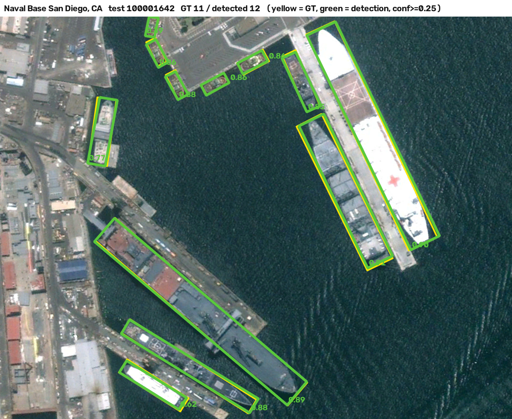
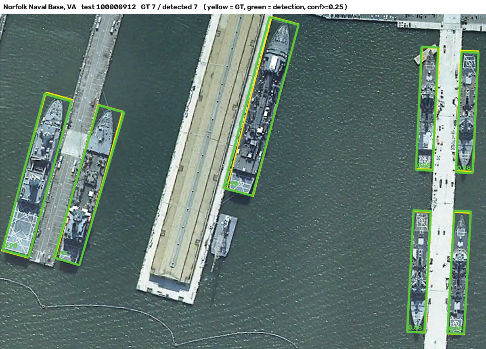
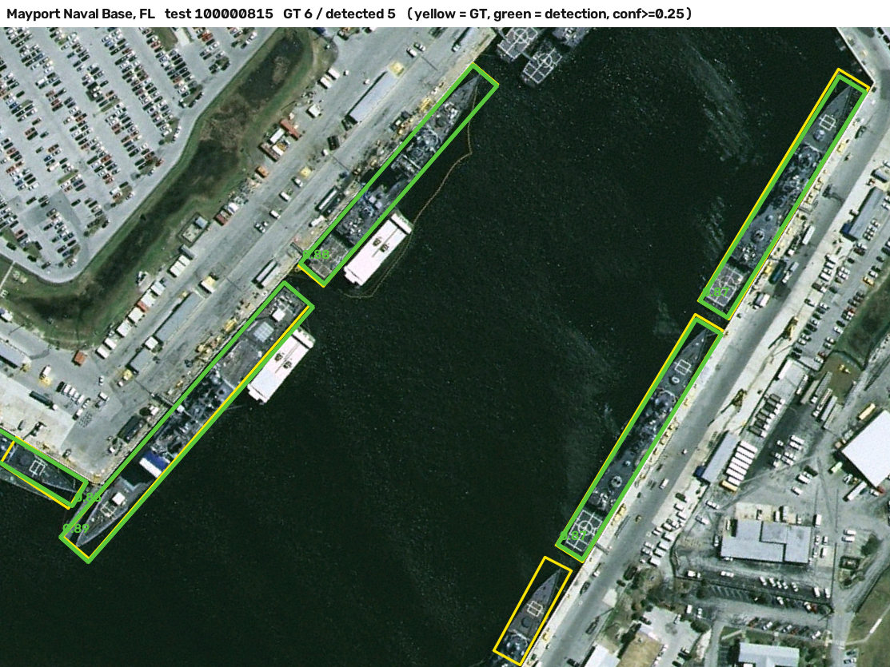
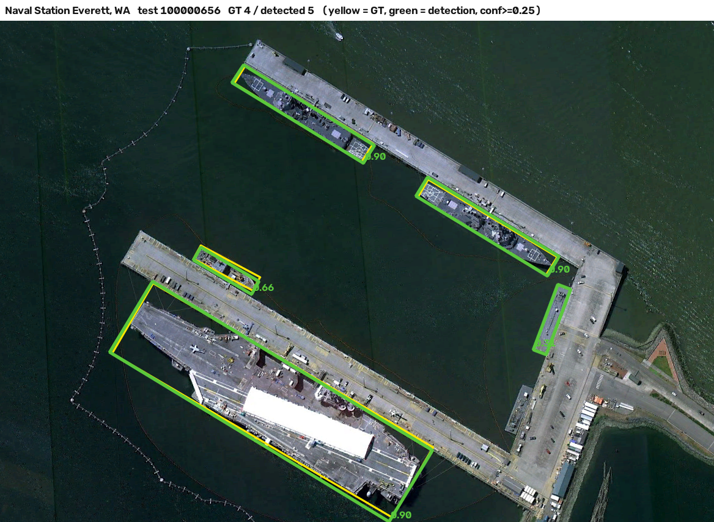
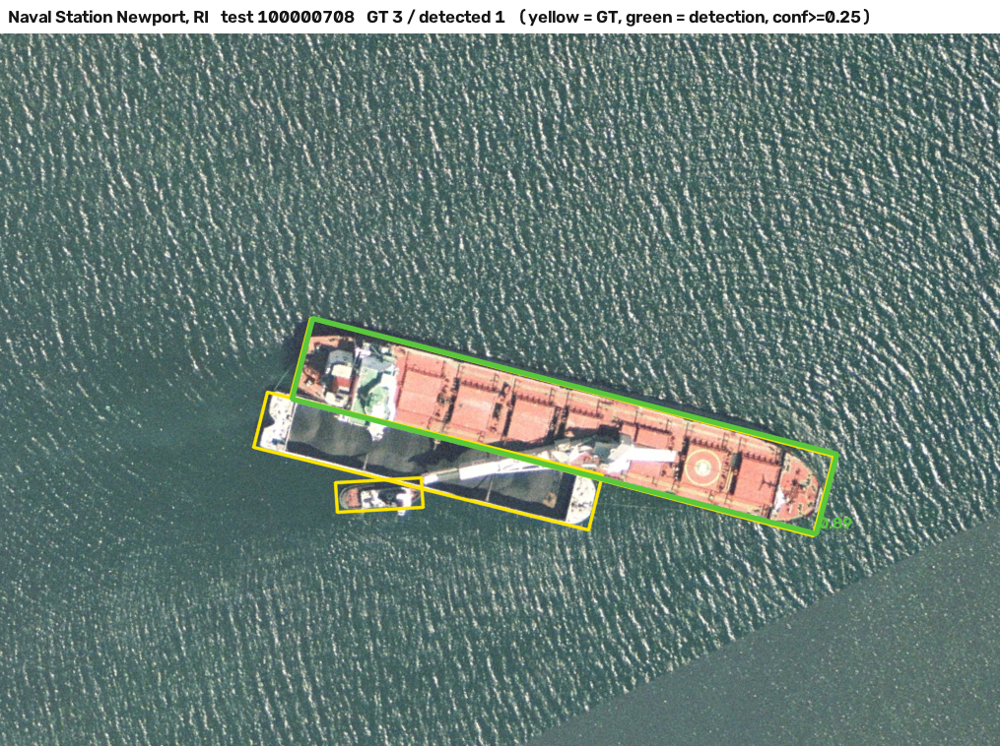
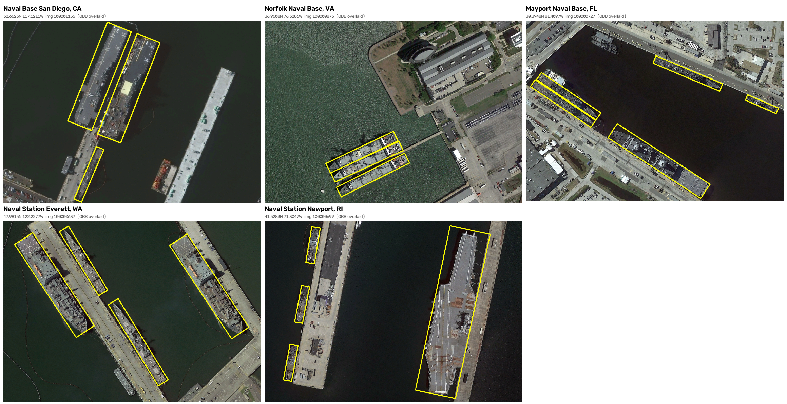

# 위성영상 선박 객체탐지 — 코멘토 4차 업무

정승원

고해상도(약 0.45 m) 광학 위성영상에서 선박을 회전상자로 찾습니다. 대상은
**HRSC2016 의 미국 해군기지 5곳**이고, 정답은 사람이 그린 회전상자 2,964척입니다.
**정답이 없으면 정밀도를 잴 수 없다**는 전제로, 실측 라벨이 있는 항만만 씁니다.

항만마다 한 장씩, 전부 학습에 쓰지 않은 test 영상입니다. 초록 = 탐지, 노랑 = 정답.

| | |
|---|---|
|  |  |
|  |  |
|  | |

## 핵심 결과

YOLO11m-OBB · 학습 429장 / test 451장(HRSC2016 공식 분할) · 67 epoch · 학습 시드 3개 평균

| precision | recall | F1 | AP50 | AP50-95 |
|---|---|---|---|---|
| 0.916 | 0.957 | **0.936** | 0.970 | 0.770 |

항만별 AP50 (그 항만의 test 영상만으로):

| 항만 | test 선박 | AP50 |
|---|---:|---:|
| 샌디에이고 해군기지, CA | 683 | 0.972 |
| 노퍽 해군기지, VA | 308 | 0.981 |
| 메이포트 해군기지, FL | 160 | 0.952 |
| 에버렛 해군기지, WA | 52 | 0.974 (표본 부족) |
| 뉴포트 해군기지, RI | 23 | 0.933 (표본 부족) |

시드 간 표준편차는 F1 ±0.004, AP50 ±0.003 입니다.

## 실행

**실행 파일(exe):** https://drive.google.com/file/d/1_UyBzz7vqwi1Rt795klzWUuBGtC9tKXH/view?usp=sharing
— `위성선박탐지_exe.zip`(391 MB)을 받아 풀고 `위성선박탐지\위성선박탐지.exe` 를 실행하면
브라우저가 열립니다. 파이썬 설치 불필요, Windows 10/11 64bit.

> 가중치(`weights/*.pt`)와 영상(`data/`)은 저장소에 넣지 않았습니다. HRSC2016 은
> Google Earth 화면 수집 영상이라 재배포가 제한됩니다. 만드는 법은 아래
> "자료 만들기" 에 있습니다.

소스로 직접 돌리려면:

```
py -m streamlit run webapp/app_ship.py --server.port 8502
```

사이드바에서 항만을 고르면 그 항만의 test 영상을 **◀ 이전 / 다음 ▶** 으로
돌아가며 탐지합니다. 영상을 직접 올릴 수도 있습니다(.tif 는 GeoJSON 으로
위경도 내보내기). 회전상자라 길이·폭·방향이 표로 나옵니다.

## 시험

```
py -m pytest webapp/tests -q
```

모델 정확도가 아니라 **모델 앞뒤의 배관**을 봅니다 — 영상 읽기·정규화·좌표 변환.

## 구성

`webapp/` 은 실행하는 것, `pipeline/` 은 만드는 과정(파일 번호가 곧 순서), `kaggle_train/` 은 GPU 학습.

```
webapp/
  app_ship.py                            웹앱 화면
  ship_core.py                           영상 읽기·정규화·좌표 변환
  launch.py                              실행 파일 진입점
  ship_detect.spec                       PyInstaller 설정
  tests/                                 단위 시험
pipeline/
  config.yaml                            경로·학습·평가 설정 (한 곳)
  common.py                              설정 로드 · 항만 좌표표 · 진짜 GSD 계산
  step1_download_hrsc2016.py             Kaggle 내려받기 + RAR 추출 (bsdtar)
  step2_inspect_metadata.py              XML 전수 조사 · 좌표 군집
  step3_identify_ports_and_gsd.py        항만 식별 · GSD 검증 · manifest
  step4_convert_labels_to_yolo_obb.py    XML 회전상자 -> YOLO OBB
  step5_validate_labels.py               라벨 100장 시각검증
  step6_train_yolo.py                    학습 (예산 자동조정 · 이어하기)
  step7_evaluate_yolo.py                 P/R/F1/AP50/AP75/mAP · 항만별 · 크기별
  step8_port_metrics_for_webapp.py       웹앱용 항만별 실측표 (outputs/port_metrics.json)
  step9_draw_port_figures.py             항만별 탐지 그림 (outputs/fig1_*.png)
  step10_make_ppt.py                     발표자료 3장
kaggle_train/
  kaggle_train_and_evaluate.py           Kaggle T4 커널 (step6 -> step7)
  kernel-metadata.json
outputs/                                 그림 · 항만별 실측표
weights/                                 hrsc_hr045_seed0.pt            (저장소 밖)
data/hrsc/                               test 영상 451장 · 라벨 · manifest (저장소 밖)
```

---

## 자료를 어떻게 확인했나

### 항만 식별 — 공식 문서에는 이름이 없습니다

HRSC2016 소개 문서는 *"six famous harbors"* 라고만 하고 어느 항만인지 밝히지
않습니다. 영상별 항만 manifest 도 없습니다. 대신 XML 에 좌표가 있습니다.

```xml
<Img_Location>32.6623,117.121053</Img_Location>
```

**경도에 부호가 없습니다.** 그대로 동경으로 읽으면 중국 내륙(안후이성)이 되어
항만이 있을 수 없습니다. 동경/서경 두 해석을 모두 시험해 알려진 항만과 25 km
안에 드는 것만 인정했습니다. 25 km 로 군집화하면 7개가 나오고 무르만스크 2개를
합치면 **6개** — 문서의 "six" 와 맞습니다.



| 항만 | XML 군집 중심 | 실제 기지 | 오차 | 영상 | 선박 |
|---|---|---|---:|---:|---:|
| San Diego | 32.6623, 117.1211W | 32.68, 117.13W | ~2 km | 526 | 1,719 |
| Norfolk | 36.9608, 76.3286W | 36.95, 76.33W | ~1 km | 283 | 721 |
| Mayport | 30.3948, 81.4097W | 30.39, 81.42W | ~1 km | 146 | 350 |
| Everett | 47.9815, 122.2277W | 47.99, 122.22W | ~1 km | 77 | 116 |
| Newport | 41.5283, 71.3047W | 41.53, 71.32W | ~1.5 km | 27 | 58 |
| Murmansk (RU) | 69.04~69.22, 33.19~33.39E | — | — | 622 (라벨 11) | 13 |

라벨이 붙은 1,070장 중 **1,059장(99 %)이 미국 항만**입니다. 좌표는 데이터셋이
준 사실이고 부호 보정과 항만 이름은 우리 식별입니다 — manifest 의
`verification_status` 에 그렇게 적었습니다. 지형만 보고 항만을 정하지 않았습니다.

### GSD — XML 의 1.07 m 는 실제 해상도가 아닙니다

`Img_Resolution=1.07` 을 믿으면 선박 장변 중앙값이 **360 m**, 최대 **987 m** 가
됩니다. 실존 최대 선박이 458 m 입니다. Google Earth 타일 레벨 18 의 실제 분해능

```
gsd = 156543.03392 * cos(lat) / 2^18      ->  노퍽 0.48 · 샌디에이고 0.50 · 에버렛 0.40 m/px
```

로 다시 재면 미국 항만 선박 2,964척의 장변 분포가 **p50 166 · p90 271 · p99 347 m**
이고, p99 가 Nimitz 급 항모(333 m)와 +4 % 로 맞습니다. 노퍽 부두의 341×47 px
상자는 이 GSD 로 154×21 m — Arleigh Burke 급 구축함(155×20 m)입니다. 폭까지 맞는
것이 결정적입니다. XML 값은 위도 보정이 없는 명목값입니다.

### 왜 회전상자인가

군함은 부두에 비스듬히 댑니다. 축정렬 상자는 이웃 배와 부두를 크게 포함해서
길이·폭을 못 재고 IoU 도 흐려집니다. HRSC2016 정답이 사람이 그린 회전상자라
모델도 회전상자(YOLO11-OBB)를 냅니다. XML 의 `mbox_ang` 은 라디안이고, 꼭짓점은
왼쪽-위에서 시계방향으로 고정했습니다. 변환이 맞는지 100장을 그려 확인했습니다.

### 학습 조건

- 공식 train/val/test 분할(436 / 181 / 453). 항만이 세 쪽에 섞이므로, 항만
  단위 재분할(학습 샌디에이고·노퍽 → 시험 에버렛·뉴포트)로 누수 영향을 따로
  확인했습니다 — 결론이 바뀌지 않았습니다.
- 학습 중 validation 을 끄고 **고정 epoch 의 last.pt** 를 씁니다. `best.pt` 는
  fitness 로 고르는데 비교군마다 다른 epoch 이 뽑히면 "학습량 동일" 조건이
  깨집니다. 3차에서도 last 가 test 에서 일관되게 나았습니다.
- epochs 는 100 을 계획했으나 GPU 예산(Kaggle T4 9시간)에 맞춰 67 로 낮췄습니다.
  모든 런에 똑같이 적용했고 시드 편차가 ±0.004 라 수렴은 충분합니다.

## 자료 만들기 · 재현

```
py pipeline/step1_download_hrsc2016.py --dest ../../hrsc2016   # Kaggle guofeng/hrsc2016, 5분할 RAR 를 bsdtar 로 추출
py pipeline/step2_inspect_metadata.py
py pipeline/step3_identify_ports_and_gsd.py --verify-gsd       # 항만 식별 · GSD 검증 · manifest
py pipeline/step4_convert_labels_to_yolo_obb.py                # 회전상자 라벨
py pipeline/step5_validate_labels.py --n 100
py pipeline/step6_train_yolo.py --split official               # 로컬 GPU 가 있으면. 없으면 kaggle_train/ 으로
py pipeline/step7_evaluate_yolo.py --split official
py pipeline/step8_port_metrics_for_webapp.py                   # 웹앱 항만별 표
py pipeline/step9_draw_port_figures.py                         # 항만별 그림
py pipeline/step10_make_ppt.py
```

## 라이선스와 한계

- HRSC2016 — Liu Z. et al., ICPRAM 2017. Google Earth 화면 수집 영상이라 학술
  목적 사용은 가능하지만 **원본·파생 영상을 재배포하지 않습니다.**
- Ultralytics YOLO11 은 AGPL-3.0 입니다.
- 군함 데이터셋(장변 중앙 152 m)이라 민간 어선·화물선에 그대로 옮기면 낙관적입니다.
- 에버렛(52척)·뉴포트(23척)는 항만별 수치의 신뢰구간이 항만 간 차이보다 큽니다.
- GSD 는 계산식 값입니다. 함급 역산과 4 % 안에서 맞지만 영상별 실측치는 아닙니다.
