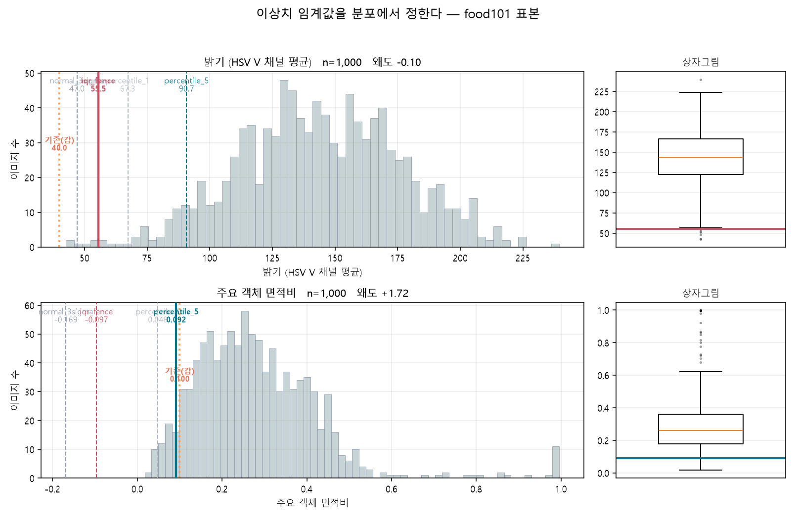

# 코멘토 직무부트캠프 1차 업무 — Git 코드 관리 & 픽셀 단위 이미지 처리

Computer Vision POC를 위한 기초 실습입니다. Git 브랜치 전략으로 코드를 관리하고,
OpenCV로 픽셀 단위 색상 검출과 AI 학습용 전처리 파이프라인을 구현했습니다.

> **리뷰 반영 (2026-08-20)** — 멘토 피드백 3건을 코드에 반영했습니다. 요약은
> [9. 리뷰 반영 내역](#9-리뷰-반영-내역)에 있고, 각 항목은 해당 절에 녹여 두었습니다.
>
> | 지적 | 반영 |
> |---|---|
> | 임계값을 감이 아니라 분포로 정할 것 | `threshold_study.py` — 1,000장 분포 → 왜도로 기준 선택 |
> | 정답 마스크가 없을 때 품질 판정법 | `detection_audit.py` — 100패치 표본조사 + 능동학습 |
> | 증강은 저장하지 말고 학습 중 실시간으로 | `dataset.py` — PyTorch Dataset `__getitem__` 증강 |

## 1. 구성

```
jsw-comento-bootcamp/
├── color_pixel_filter.py       # [요청내용 2] 특정 색상 픽셀 감지 및 필터링
├── image_preprocessing.py      # [추가 요청] 전처리 파이프라인 (기본 + 심화)
├── threshold_study.py          # [피드백 1] 이상치 임계값 분포 조사
├── detection_audit.py          # [피드백 2] 정답 마스크 없는 검출 품질 표본조사
├── dataset.py                  # [피드백 3] 실시간 증강 Dataset / DataLoader
├── thresholds.json             # 분포에서 산출한 임계값과 그 근거
├── preprocessed_samples/       # [제출 항목] 전처리를 마친 이미지 5장 + 품질 리포트
├── outputs/                    # 색상 검출 결과, 분포 히스토그램, 표본조사 시트
│   ├── audit/                  # 판정용 패치 격자 + 판정 CSV
│   └── preview/                # 참고용: 단계별 비교 격자, 실시간 증강 시연
├── data/                       # 원본 캐시 (용량 문제로 .gitignore 처리)
├── requirements.txt
└── README.md
```

## 2. 실행 방법

```bash
pip install -r requirements.txt

# [1] 이상치 임계값을 분포에서 정한다 (1,000장 측정, 약 30초)
python threshold_study.py --num-images 1000

# [2] 전처리 파이프라인 — 위에서 나온 thresholds.json 을 읽어 쓴다
python image_preprocessing.py --num-images 40 --num-samples 5

# [3] 실시간 증강 DataLoader 시연
python dataset.py --num-images 40
```

색상 검출에 쓰는 위성 이미지는 `data/`가 `.gitignore` 대상이라 저장소에 없습니다.
아래 명령으로 원본을 받으면 그대로 재현됩니다.

```bash
mkdir -p data
curl -o data/saltpond_aiguesmortes_landsat8.jpg \
  https://assets.science.nasa.gov/content/dam/science/esd/eo/images/imagerecords/144000/144777/graudoroi_oli_2018241_lrg.jpg

# 색상 픽셀 검출
python color_pixel_filter.py --image data/saltpond_aiguesmortes_landsat8.jpg --color red-orange

# 검출 품질 표본조사 (판정 시트 생성 → 사람이 채움 → 채점)
python detection_audit.py --image data/saltpond_aiguesmortes_landsat8.jpg --color red-orange
python detection_audit.py --score outputs/audit/audit_red-orange_random.csv
```

## 3. 픽셀 단위 색상 처리 (`color_pixel_filter.py`)

| 단계 | 사용 함수 | 목적 |
|---|---|---|
| 로드 | `cv2.imread()` | BGR uint8 배열로 읽습니다. 실패 시 `None`을 돌려주므로 명시적으로 검사합니다 |
| 통계 | `cv2.split()` | 채널별 평균·표준편차·최솟값·최댓값으로 픽셀 분포를 파악합니다 |
| 색공간 변환 | `cv2.cvtColor(BGR2HSV)` | 색상(H)과 밝기(V)를 분리해 조명 변화에 강인하게 만듭니다 |
| 색상 감지 | `cv2.inRange()` | HSV 범위 안의 픽셀만 255로 남긴 마스크를 만듭니다 |
| 이진화 | `cv2.threshold()` | 밝기 기준 필터링 결과를 비교군으로 함께 출력합니다 |
| 필터링 | `cv2.bitwise_and()` | 마스크 영역의 원본 픽셀만 추출합니다 |
| 후처리 | `cv2.morphologyEx()` | Open으로 점 노이즈를 제거하고 Close로 구멍을 메웁니다 |
| 검증 | `cv2.findContours()` | 검출 영역에 바운딩 박스를 그려 육안으로 확인합니다 |

**빨간색을 두 범위로 나누는 이유**: OpenCV의 Hue는 0~179이고 빨강은 0을 기준으로
양쪽 끝(0~10, 170~180)에 걸쳐 있어 한 구간만으로는 절반을 놓칩니다.
두 마스크를 합치는 방식은 과제 예제의 `mask = mask1 + mask2` 형태를 그대로 따랐습니다.
`red-orange`가 H 0~15 한 구간뿐인 것은 대상이 H 0 위쪽에만 분포해 반대쪽 끝(170~180)에
걸리는 화소가 없기 때문입니다.

### 대상 이미지

`data/saltpond_aiguesmortes_landsat8.jpg` — 프랑스 Aigues-Mortes 염전입니다.
염전 물이 붉게 보이는 것은 고염도 환경에서 번식하는 베타카로틴 함유 플랑크톤과
호염성 세균(halobacteria) 때문입니다.

| 항목 | 값 |
|---|---|
| 센서 / 촬영일 | Landsat 8 OLI / 2018-08-20 |
| 출처 | [NASA Earth Observatory](https://science.nasa.gov/earth/earth-observatory/salin-aigues-mortes-144777) (public domain) |
| 크레딧 | NASA Earth Observatory image by Lauren Dauphin, using Landsat data from the U.S. Geological Survey |
| 크기 | 2131×1421 (원본 그대로 사용) |

### 검출 범위를 바꾼 근거

```
mean_bgr          : [88.63, 81.83, 69.08]
[red 검출]         12,324 px / 3,028,151 px (0.41%)
[red-orange 검출]  26,501 px / 3,028,151 px (0.88%)
```

과제 예제의 빨강 범위(H 0~10, S≥120)로는 염전이 **0.41%만 검출됩니다.**
염전 화소를 직접 측정하니 **H 7~11, S 96~135, V 76~223** 이었습니다. 색상(H)은 범위
안에 들어오지만, 채도(S)가 96~119인 화소가 하한 120에 걸려 잘려나간 것이 원인입니다.

측정값에 맞춰 별도 범위 `red-orange`(H 0~15, S≥100)를 추가하니 검출량이 **2.15배**로
늘었습니다. `red` 범위는 과제 예제값 그대로 유지했습니다.

### 3-1. 정답 마스크 없이 검출 품질 판정하기 (`detection_audit.py`)

전에는 "정답 마스크가 없으므로 정확한지 판정할 수 없다"로 끝냈습니다. 전수 채점을
못 할 뿐이지 판정을 못 하는 것은 아닙니다. **표본을 뽑아 눈으로 판정하면 전체
정확도를 구간으로 추정할 수 있습니다.**

대상이 이미지 1장(2131×1421)이므로 "무작위 100장"을 **무작위 100개 패치**로 옮겼습니다.
각 패치는 64×64 크롭이고 정중앙 화소 하나가 판정 대상입니다(십자로 표시).

**층화 추출이 필요한 이유** — 화면 전체에서 균등하게 뽑으면 염전이 0.88%뿐이라
100개 중 한 개 남짓만 양성입니다. 그 표본으로는 놓친 화소를 찾을 수가 없습니다.
그래서 검출된 화소에서 50개, 검출 안 된 화소에서 50개를 따로 뽑습니다. 판정할 때는
어느 층에서 왔는지 모르도록 섞어 두어 판정 편향을 막습니다.

**결과** (n=50씩, 윌슨 95% 신뢰구간)

| 표본 전략 | 정밀도 (검출한 게 실제 염전) | 놓침률 (안 잡은 게 사실은 염전) |
|---|---|---|
| `random` — 각 층에서 균등 추출 | **88.0%** (76.2 ~ 94.4%) | **0.0%** (0.0 ~ 7.1%) |
| `uncertain` — 경계 화소 우선 | 76.0% (62.6 ~ 85.7%) | 10.0% (4.3 ~ 21.4%) |

윌슨 구간을 쓴 이유는 놓침률처럼 비율이 0에 붙는 경우 단순 정규 근사가 구간을
음수까지 늘려 쓸 수 없기 때문입니다.

**`uncertain`은 능동학습(active learning) 방식입니다.** HSV 범위 경계까지의 여유가
가장 작은 화소, 즉 기준이 조금만 달랐어도 판정이 뒤집혔을 화소를 우선 뽑습니다.
같은 100개를 판정해도 어디를 고쳐야 하는지에 대해 훨씬 많이 알게 됩니다. 실제로
**무작위 표본은 놓침을 0개 찾았지만 능동학습 표본은 50개 중 5개를 찾아냈습니다.**
놓칠 만한 곳은 경계 근처에 몰려 있고, 무작위 추출은 그곳에 잘 닿지 않습니다.

**여기서 나온 부정적 결과 하나** — 무작위 표본에서 오검출 화소의 경계 여유
중앙값은 **+0.310**으로 정검출(+0.297)보다 오히려 **큽니다.** 오검출이 범위 가장자리가
아니라 한가운데에 있다는 뜻이고, HSV 범위를 좁히면 정검출이 함께 잘려 나갑니다.
실제로 오검출로 판정된 패치는 대부분 붉은 갈색 농경지와 마을 지붕이었습니다.
**이 오검출은 임계값 조정으로는 못 고칩니다.** 형태나 질감을 함께 보거나
근적외선 밴드를 쓰는 쪽으로 가야 합니다.

> **판정자 주의** — `outputs/audit/*.csv`의 현재 판정은 절차가 끝까지 돌아가는지
> 확인하기 위해 모델이 채운 시연용 값입니다(`note=demo-judge:model`). 제출 전에
> 격자 이미지를 보고 직접 판정해 덮어써야 합니다. 위 수치는 그때 바뀝니다.

### 남은 한계

`red-orange` 범위는 이 한 장면에서 측정한 값이라, 다른 조명·계절·센서 조건에서도
통할지는 확인되지 않았습니다. 표본조사도 이미지 1장에 대한 것이라 장면이 바뀌면
다시 해야 합니다.

## 4. 전처리 파이프라인 (`image_preprocessing.py`)

### 4.1 데이터 수집
`datasets` 라이브러리의 `streaming=True`로 food101에서 필요한 장수만 수신합니다.
전체는 5GB 이상이라 전량 다운로드가 불필요합니다. food101은 클래스 순으로 정렬돼 있어
그대로 받으면 전부 같은 음식이 나오므로, `shuffle(seed=42)`로 클래스를 섞고
seed를 고정해 재현성을 확보했습니다.

### 4.2 처리 순서와 근거

| 순서 | 단계 | 구현 | 왜 이 순서인가 |
|---|---|---|---|
| 1 | 크기 조정 224×224 | `cv2.resize(INTER_AREA)` | 축소가 대부분이라 `INTER_AREA`의 에일리어싱이 가장 적습니다 |
| 2 | 노이즈 제거 | `cv2.GaussianBlur(5,5)` | 리사이즈 **뒤**에 두어야 커널이 항상 같은 화소 비율로 작동합니다 |
| 3 | 그레이스케일 | `cv2.cvtColor(BGR2GRAY)` | 3채널을 1채널로 줄여 연산량이 1/3이 됩니다 |
| 4 | 정규화 | `/255.0 → float32` | 입력을 0~1로 맞춰 학습 시 gradient 스케일을 안정화합니다 |

### 4.3 이상치 필터링 — 임계값을 분포에서 정한다 (`threshold_study.py`)

전처리 **이전**에 원본을 검사해 학습에 해로운 이미지를 걸러냅니다.

**① 너무 어두운 이미지** — HSV의 V 채널 평균으로 판정합니다. BGR 단순 평균 대신
V를 쓰는 이유는 색상·채도의 영향을 배제하고 밝기만 보기 위해서입니다.

**② 객체가 너무 작은 이미지** — Otsu 이진화로 전경과 배경을 자동 분리하고, 배경이
밝은 경우까지 처리하기 위해 전경 픽셀이 과반이면 마스크를 반전합니다. 모폴로지로
잡음을 정리한 뒤 가장 큰 윤곽선의 면적을 전체 픽셀 수로 나눠 비율을 구합니다.

**커트라인은 food101 1,000장의 분포에서 계산합니다.** 세 가지 기준을 모두 구한 뒤
분포 모양(왜도)을 보고 어느 것을 쓸지 정합니다.

```
(a) 백분위수    하위 1% / 5%      분포 모양을 가정하지 않는다
(b) IQR 울타리  Q1 - 1.5 * IQR    상자그림의 표준 이상치 기준
(c) 정규 근사   mean - 3 * std    정규분포를 가정할 때의 0.13% 지점
```



**두 지표가 정반대로 갈렸습니다.**

| | n | 최소 | Q1 | 중앙 | Q3 | 최대 | 왜도 |
|---|---:|---:|---:|---:|---:|---:|---:|
| 밝기 (V 평균) | 1,000 | 42.55 | 122.2 | 143.2 | 166.6 | 239.5 | −0.10 |
| 객체 면적비 | 1,000 | 0.017 | 0.178 | 0.261 | 0.360 | 0.996 | +1.72 |

| | IQR 울타리 | 정규 3σ | 하위 1% | 하위 5% | **채택** | 기존(감) |
|---|---:|---:|---:|---:|---:|---:|
| 밝기 | **55.53** | 46.97 | 67.29 | 90.71 | IQR 울타리 | 40 |
| 면적비 | −0.097 | −0.169 | 0.048 | **0.092** | 하위 5% | 0.10 |

- **밝기**는 왜도 −0.10으로 대칭에 가까워 세 기준이 46~90 사이에 모입니다. 이럴 때는
  이상치 판정의 표준인 IQR 울타리를 씁니다.
- **면적비**는 왜도 +1.72로 오른쪽 꼬리가 깁니다. 이런 분포에서 IQR 울타리는
  **−0.097**로 데이터 범위 밖에 떨어져 아무것도 걸러내지 못합니다. 분포 가정이 없는
  백분위수를 써야 합니다. **IQR이 만능이 아니라는 것이 실제로 확인된 셈입니다.**

**기존 임계값과 비교하면**

| | 기존(감) | 기존 제외율 | 신규 | 신규 제외율 |
|---|---:|---:|---:|---:|
| 밝기 | 40 | **0.00%** | 55.53 | 0.60% |
| 면적비 | 0.10 | 6.00% | 0.0917 | 5.00% |

밝기 임계값 40은 **1,000장에서 한 장도 걸러내지 못했습니다.** 표본 40장에서
최저값이 54.5라 "임계값과 14.5밖에 안 떨어져 불안하다"고 적었는데, 1,000장의
실제 최저값은 **42.55**로 여유가 2.55까지 줄어듭니다. 40은 사실상 꺼져 있는
필터였습니다.

반대로 면적비 0.10은 백분위수 결과 0.0917과 거의 같습니다. **감으로 잡았지만
우연히 타당한 값이었고, 이제 근거가 생겼습니다.**

새 임계값으로 40장을 다시 돌리면 제외가 3장에서 4장으로 늘어납니다.

```
[info] 임계값 출처: thresholds.json (ethz/food101 1000장 분포,
       mean_brightness=iqr_fence / object_area_ratio=percentile_5)
       밝기 하한 55.53 / 면적비 하한 0.0917
[info] 이상치 4장 제외 / 정상 36장
       - food101_006_label51: tiny_object(ratio=0.087<0.0917)
       - food101_018_label6:  tiny_object(ratio=0.068<0.0917)
       - food101_032_label74: too_dark(mean=54.5<55.53)      <- 새로 걸린 이미지
       - food101_038_label74: tiny_object(ratio=0.059<0.0917)
```

새로 걸린 `food101_032_label74`가 바로 밝기 54.5짜리, 지난번에 "임계값에 아슬아슬하게
걸치지 않았다"고 적었던 그 이미지입니다.

산출 근거는 `thresholds.json`에 값과 함께 남습니다(표본 수, 채택 기준, 제외율).
임계값을 코드 상수로 박아 두면 왜 그 값인지 추적할 수 없기 때문입니다.

### 4.4 데이터 증강 — 저장하지 않고 학습 중 실시간으로 (`dataset.py`)

증강 결과를 미리 파일로 만들어 두던 방식을 걷어냈습니다. 두 가지가 손해입니다.

1. **저장 공간** — 증강 종류만큼 데이터셋이 배로 불어납니다.
2. **다양성** — 한 이미지가 평생 정해진 몇 장으로 고정됩니다. 에폭을 아무리 돌려도
   모델이 보는 변형은 저장해 둔 그 몇 장뿐입니다.

PyTorch `Dataset.__getitem__`에서 매번 난수를 새로 뽑습니다.

```
경로 목록 → [로드 → 리사이즈 → 무작위 증강 → 블러 → 그레이스케일 → 정규화]
          → (1, 224, 224) float32 텐서
```

| 증강 | 구현 | 모사하는 실제 변화 |
|---|---|---|
| 좌우 반전 | `cv2.flip(img, 1)`, p=0.5 | 촬영 방향 차이 |
| 회전 | `getRotationMatrix2D` + `warpAffine`, −15~+15° 균등 | 카메라 기울기. `BORDER_REPLICATE`로 검은 테두리를 막습니다 |
| 색상 변화 | HSV의 S ×0.8~1.4, V ×0.8~1.25 | 조명·화이트밸런스 차이 |

고정값(15°, 1.4배)을 구간으로 바꾼 것도 실시간이라 가능해진 부분입니다. 고정값이면
"15도 돌아간 사진"만 배우지만, 구간이면 그 사이 모든 각도를 배웁니다.

**측정 결과**

```
[실시간 증강] 인덱스 0 을 6회 반복 조회
  첫 결과 대비 평균 화소 차이: 66.3, 45.8, 17.0, 62.6, 50.3  (0 이면 매번 같은 것)
  대조: augment=False 는 매번 동일 (차이 0.0)

[용량] 텐서 1장 (1, 224, 224) = 196 KB
  사전 저장 (원본 + 증강 3종, food101 학습 75,750장 기준): 60.8 GB
  실시간 증강: 0.0 GB

[처리량] workers=0 batch=8 -> 36장 0.21s (170 img/s)
```

같은 인덱스인데 매번 다른 텐서가 나오는 것을 `outputs/preview/on_the_fly_variation.png`
에서 눈으로 확인할 수 있습니다.

**구현에서 걸렸던 것 — 워커마다 난수를 따로 줘야 합니다.**
`num_workers > 0`이면 Dataset이 피클되어 워커 프로세스로 복제됩니다. 이때 난수
생성기를 그대로 실어 보내면 **모든 워커가 같은 난수열에서 출발해 똑같은 증강을
내놓습니다.** 결과가 정상으로 보여서 찾기 어려운 종류의 버그입니다. `__getstate__`
에서 난수원을 비워 보내고, 각 워커가 자기 `torch.initial_seed()`로 새로 만들게
했습니다.

```
workers=0  에폭간 항목별 평균차 [0.197 0.145 0.075 0.  0.107 0.171 0.075]
workers=2  에폭간 항목별 평균차 [0.203 0.124 0.104 0.05 0.135 0.173 0.082]
```

Windows에서 `num_workers > 0`을 쓸 때는 실행 스크립트에 `if __name__ == "__main__":`
가드가 반드시 있어야 합니다. spawn 방식이라 워커가 `__main__`을 다시 import 하고,
가드가 없으면 워커가 즉시 죽습니다.

## 5. 결과물

- `preprocessed_samples/*.png` — 전처리를 마친 이미지 5장입니다 (224×224 그레이스케일).
  정규화 결과는 0~1 float이라 저장할 때 0~255 uint8로 되돌립니다.
- `preprocessed_samples/quality_report.json` — 전수 검사 수치와 제외 사유, 그리고
  판정에 쓴 임계값과 그 출처입니다
- `thresholds.json` — 분포에서 산출한 임계값과 근거(표본 수, 채택 기준, 제외율)
- `outputs/threshold_study.png` — 두 지표의 히스토그램·상자그림과 커트라인 후보
- `outputs/audit/audit_*.jpg` / `*.csv` — 검출 품질 판정용 패치 격자와 판정 시트
- `outputs/*.jpg|png` — 색상 검출 결과 7장입니다. 원본, 마스크 2종(`red` · `red-orange`),
  필터링 2종, 밝기 이진화, 검출 박스가 들어 있습니다. 사진 계열은 `.jpg`로,
  마스크·이진화는 값이 0/255로 유지돼야 하므로 무손실 `.png`로 저장합니다
- `outputs/preview/*_stages.png` — 단계별 결과 비교 격자 (참고용)
- `outputs/preview/on_the_fly_variation.png` — 같은 이미지가 조회할 때마다 달라지는 것

학습 입력 텐서를 `.npy`로 미리 저장하던 코드는 지웠습니다. 학습 입력을 디스크에
쌓아 두는 것이 바로 위에서 걷어낸 낭비이기 때문입니다.

## 6. Git 워크플로

```
main ────────────────────────────────────────────●  (PR #1 병합)
  └── feature/image-processing ─── 리뷰 반영 커밋 ─┘
```

1. `git init` → `git remote add origin <URL>`
2. `git checkout -b feature/image-processing`
3. 기능 단위로 `git add` / `git commit`
4. `git push origin feature/image-processing`
5. GitHub에서 PR 생성 → **코드 리뷰 → 리뷰 반영 커밋 → `main` 병합**

`main`에 직접 커밋하지 않고 feature 브랜치를 거치는 이유는, 리뷰 전 코드가
기준 브랜치를 오염시키지 않게 하고 PR 단위로 변경 이력을 추적하기 위해서입니다.
피드백 반영분도 새 브랜치를 파지 않고 **열려 있던 PR #1 위에 커밋**한 뒤 병합했습니다.
리뷰에서 지적된 내용이므로, 그 PR 안에 지적과 대응이 같이 남는 편이 이력으로서
읽기 좋기 때문입니다.

## 7. 환경

Python 3.11.9 / OpenCV 5.0.0 / NumPy 2.4.6 / PyTorch 2.13.0+cpu /
SciPy 1.17.1 / matplotlib 3.11.1 / Windows 11

## 8. 재현 시 주의

- `threshold_study.py`를 먼저 돌려야 `thresholds.json`이 생깁니다. 없으면
  `image_preprocessing.py`는 기존 기본값(40 / 0.10)으로 동작하면서 그 사실을
  출력에 알립니다.
- Hugging Face는 비인증 요청에 속도 제한이 있습니다. `HF_TOKEN`을 설정하면 빨라집니다.
- `outputs/audit/*.csv`의 판정값은 시연용입니다. 3-1절의 주의 문구를 참고하세요.

## 9. 리뷰 반영 내역

| # | 지적 | 반영 내용 | 확인 가능한 곳 |
|---|---|---|---|
| 1 | 이상치 기준값을 감이 아니라 분포(히스토그램·백분위수·IQR)로 정할 것 | 1,000장 분포 측정 → 왜도로 기준 선택 → 밝기 40→55.53, 면적비 0.10→0.0917. 기존 밝기 임계값이 1,000장 중 0장을 걸렀다는 사실 확인 | `threshold_study.py`, `thresholds.json`, 4.3절 |
| 2 | 정답 마스크가 없으면 표본을 뽑아 사람이 판정하고, 애매한 영역을 우선 보는 능동학습을 쓸 것 | 100패치 층화 표본조사 + 윌슨 신뢰구간. 무작위 표본과 능동학습 표본을 나란히 실행해 능동학습이 놓침을 5개 더 찾는 것을 확인 | `detection_audit.py`, 3-1절 |
| 3 | 증강은 미리 저장하지 말고 학습 중 실시간으로 걸 것 | PyTorch `Dataset.__getitem__` 실시간 증강. 사전 저장 대비 60.8 GB 절약, 고정값을 구간 난수로 확장. `.npy` 사전 저장 제거 | `dataset.py`, 4.4절 |

3주차 딥러닝 모델 학습에서는 `dataset.py`의 `Food101Dataset`을 그대로 물려
`make_loader()`로 학습 루프에 연결할 수 있게 만들어 두었습니다.
